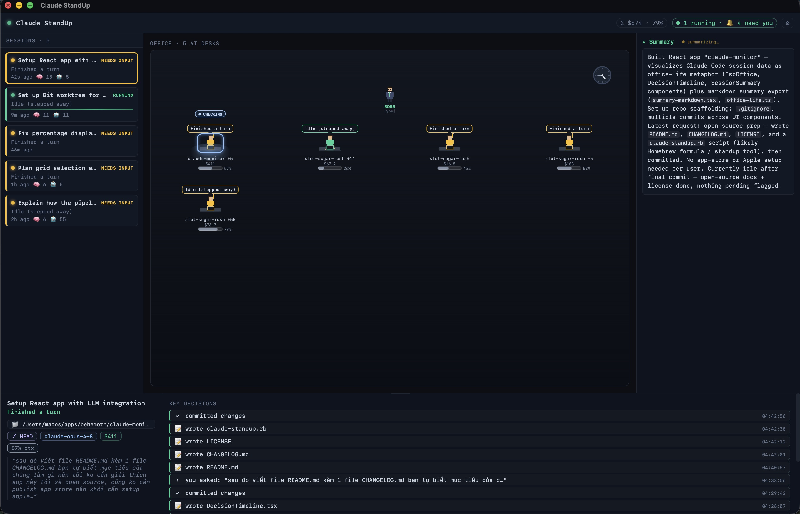

# Claude StandUp

Watch your active **Claude Code** sessions like a tiny office standup — each
session is a pixel employee at a desk, you're the boss handing out work, and a
single glance tells you who's running, who needs you, and who's idle.

Native macOS app. Local-only. Read-only. No account, no telemetry.

> Inspired by [paulrobello/claude-office](https://github.com/paulrobello/claude-office).



## Why

When you run several Claude Code sessions at once, it's easy to lose track of what
each one is doing. Claude StandUp turns that firehose of terminals into one calm
view:

- **One desk per session** — a live status bubble ("Running tests", "Waiting for
  you", "Idle"), color-coded by state.
- **You are the boss** — every prompt you send beams to that agent's desk with a
  speech bubble, so you remember what you asked each session to do.
- **Cost + context at a glance** — per-session USD cost and a context-window
  "HP bar" (aware of the 200k vs 1M model windows).
- **Key decisions timeline** — prompts answered, PRs opened, subagents spawned,
  commits, files written.
- **Auto summaries** — a short rundown of each session, generated locally by the
  `claude` CLI (no API key needed).

## How it works

Claude Code writes a transcript for every session to
`~/.claude/projects/<project>/<session-id>.jsonl`. Claude StandUp **reads** these
files (never writes), tails them live, and derives state / cost / decisions.
Summaries shell out to your local `claude -p`, reusing your existing Claude login.

Nothing leaves your machine.

## Requirements

- macOS 10.15+
- [Rust](https://rustup.rs) — rustup `stable` (≥ 1.88; Homebrew's rustc is too old)
- [Node.js](https://nodejs.org) ≥ 18 and [pnpm](https://pnpm.io)
- [Claude Code](https://docs.anthropic.com/en/docs/claude-code) CLI — optional,
  only for the auto-summary feature

## Install

### Homebrew (cask)

```sh
brew tap bachdx2812/tap
brew install --cask claude-standup
```

> This needs a published GitHub Release. Until one exists, build from source
> (below). A ready-to-use cask lives at [`Casks/claude-standup.rb`](Casks/claude-standup.rb)
> — point a [tap](https://docs.brew.sh/Taps) at it, or
> `brew install --cask ./Casks/claude-standup.rb` after dropping a `.dmg` into a
> release.

### Build from source

```sh
git clone https://github.com/bachdx2812/claude-standup.git
cd claude-standup
pnpm install

# Run in dev (hot reload)
./scripts/dev.sh

# …or build a local .app + .dmg
./scripts/build.sh
```

The build output lands in `src-tauri/target/release/bundle/`:

- `dmg/Claude StandUp_<version>_<arch>.dmg`
- `macos/Claude StandUp.app`

Drag the `.app` into `/Applications`.

#### First launch (unsigned app)

The app isn't code-signed (open source, no Apple Developer account), so Gatekeeper
warns on first open. Either:

- Right-click the app → **Open** → **Open**, or
- `xattr -dr com.apple.quarantine "/Applications/Claude StandUp.app"`

## Usage

- The **office** (center) shows one desk per recent session. Click a desk — or a
  card in the left list — to **check** that session.
- Checking a session highlights its employee, shows its **summary** in the right
  column, and its **info + key decisions** in the footer.
- Drag the footer's top edge to resize it.
- The gear menu (top-right) controls how far back to show sessions, auto-popup on
  activity, and an optional summary model.

## Configuration

| Setting                      | What it does                                          |
| ---------------------------- | ----------------------------------------------------- |
| Show sessions active within  | Recency window (1 / 3 / 12 / 24 hours)                |
| Auto-popup on activity       | Bring the window forward when a session needs you     |
| Summary model                | Optional model override for `claude -p` (blank = default) |

Settings persist locally.

## Development

```
src/                 React + TypeScript frontend
  components/        IsoOffice (canvas office), DecisionTimeline, SessionSummary, …
  lib/               shared types + formatting helpers
  store/             Zustand store
src-tauri/           Rust core: transcript discovery, tailing, parsing, state, pricing
scripts/             dev.sh / build.sh (pin the rustup stable toolchain)
```

Stack: **Tauri v2 · Rust · React 18 · TypeScript · Vite · Zustand · Canvas 2D**.

- Type-check the frontend: `pnpm build` (runs `tsc`).
- Check the Rust core: `cargo check --manifest-path src-tauri/Cargo.toml`
  (use the rustup `stable` toolchain — see `scripts/dev.sh`).

## Privacy

- Reads transcripts **read-only**; never modifies your `~/.claude` data.
- No network calls beyond the local `claude` CLI you already use.
- No telemetry.

## License

[MIT](LICENSE)
